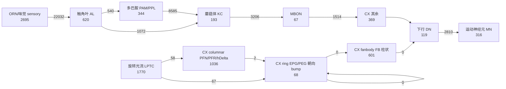

# 果蝇神经电路简图 (MaleCNS v1.0 → 模组实际运行的回路)

这份简图不是手绘的示意图，而是从游戏实际加载的那个 blob 里算出来的：每个人群、每条通路、
每个 CX 亚family 的突触数都是回路里的真实计数。细胞类型名来自 MaleCNS v1.0 注释表，
并给出它在 FlyWire（雌性脑，v783）体系里的对应检索——MaleCNS 与 FlyWire 是同一物种的雄/雌两半，
两套命名必须互相索引，才能把"果蝇的朝向回路"当作同一件事来讨论。

- blob: `flymind.brain` — 12000 神经元 / 1615753 突触 / 540052 抑制性 (33%)
- 注释: `annotations.tsv` — 211577 个 body，覆盖回路内 12000/12000 个神经元
- 视觉中继 (LPTC → X → CX): 1122 个细胞，其中 54 个属于 CX 环的输入类型；0 个尚未命名
- 元数据: `{"source":"MaleCNS v1.0 (Berg et al. 2026)","model":"Shiu et al. 2024 LIF, w_syn=0.275","n_neurons":12000,"n_edges":1615753,"n_inhibitory_synapses":540052,"n_plastic_synapses":3206,"sign_source":"consensus_nt per presynaptic cell (GABA/glutamate/histamine negative)","seeds":{"sugar":60,"motor":312,"odor":5262,"selfmotion":1770,"centralcomplex":2074,"visualrelay":1122},"populations":{"unknown":3802,"sensory":2695,"antennal_lobe":620,"kenyon_cell":193,"dopamine":344,"mbon":67,"descending":119,"motor":316,"self_motion":1770,"central_complex":2074},"source_weight_unit":1000,"cx_subfamilies":{"ring":68,"columnar":1036,"fanbody":601,"other":369}}`

## 0. 简图 (数字全部由 blob 现算)

```
        嗅觉 (食物)                           视觉 (复眼 → 视叶)
   ┌───────────────────┐                ┌──────────────────────────┐
   │ ORN/味觉  sensory │                │ 旋转光流细胞 LPTC        │
   │          2695      │                │ (H1/H2/VS/V1/HS/JO-EV)   │
   └─────┬─────────────┘                │          1770            │
         │  22032                       └───┬──────────────────┬───┘
   ┌─────▼─────────────┐                    │     67 → ring      │   4355 → CX
   │ 触角叶     AL     │                    │     58 → columnar  │ 10432 → AL
   │           620      │                    │                          │
   └──┬──────────────┬──┘                    │                          │
      │  1072 → KC   │                          │                          │
   ┌──▼───────────┐  │   ┌──────────────────────▼──────────────────────┐
   │ 蘑菇体 KC    │  │   │            中央复合体 CX   2074              │
   │        193     │  │   │  ring(EPG/PEG)   68  ← 朝向 bump       │
   └──┬───────────┘  │   │  columnar      1036  (PFN/PFR/hDelta)   │
      │  3206      │   │  fanbody(FB)    601  (转向)            │
   ┌──▼───────────┐  │   │  other          369  (LAL/IB/ER/TuBu)   │
   │ MBON      67   │  │   └───────┬───────────────────────┬───────────┘
   └──────────────┘  │           │  84871 → fanbody      │  1096 → AL
                     │   ┌───────▼────────┐              │
                     └──▶│ 下行神经元 DN  │              │
                         │        119     │              │
                         └───────┬────────┘              │
                                 │   2810 → motor
                         ┌───────▼────────┐
                         │ 运动神经元 MN  │   → 飞行肌 / 腿
                         │        316     │
                         └────────────────┘
```



> 视觉一侧是这份工作真正关心的通路：`LPTC → ring`、`columnar → ring`、`ring → ring`、
> `ring → fanbody → DN → motor` 就是"看见 → 朝向 → 转向"的完整链。第三人称视角下，
> 这条链的**输入端**（LPTC 所在的那部分视野）被果蝇自己的身体遮住，这正是要检验的扰动。

## 1. 人群与 CX 亚family

| 人群 | 神经元 | 占回路 | 主要细胞类型 (MaleCNS `type`) |
|---|---:|---:|---|
| `sensory` | 2695 | 22.5% | [ORN_DA1](https://codex.flywire.ai/app/search?search=ORN_DA1)×204, [ORN_VA1d](https://codex.flywire.ai/app/search?search=ORN_VA1d)×132, [ORN_VA1v](https://codex.flywire.ai/app/search?search=ORN_VA1v)×130, [ORN_DL3](https://codex.flywire.ai/app/search?search=ORN_DL3)×103, [ORN_VL2a](https://codex.flywire.ai/app/search?search=ORN_VL2a)×98, [ORN_VM5d](https://codex.flywire.ai/app/search?search=ORN_VM5d)×84 |
| `antennal_lobe` | 620 | 5.2% | [WEDPN8C](https://codex.flywire.ai/app/search?search=WEDPN8C)×13, [VM5d_adPN](https://codex.flywire.ai/app/search?search=VM5d_adPN)×12, [M_vPNml53](https://codex.flywire.ai/app/search?search=M_vPNml53)×12, [WEDPN8B](https://codex.flywire.ai/app/search?search=WEDPN8B)×11, [WEDPN1A](https://codex.flywire.ai/app/search?search=WEDPN1A)×10, [DL2d_adPN](https://codex.flywire.ai/app/search?search=DL2d_adPN)×9 |
| `kenyon_cell` | 193 | 1.6% | [KCg-m](https://codex.flywire.ai/app/search?search=KCg-m)×148, [KCa'b'-ap1](https://codex.flywire.ai/app/search?search=KCa%27b%27-ap1)×29, [KCa'b'-ap2](https://codex.flywire.ai/app/search?search=KCa%27b%27-ap2)×6, [KCg-d](https://codex.flywire.ai/app/search?search=KCg-d)×3, [KCg-s2](https://codex.flywire.ai/app/search?search=KCg-s2)×2, [KCg-s1](https://codex.flywire.ai/app/search?search=KCg-s1)×2 |
| `dopamine` | 344 | 2.9% | [PAM08](https://codex.flywire.ai/app/search?search=PAM08)×50, [PAM01](https://codex.flywire.ai/app/search?search=PAM01)×44, [PAM04](https://codex.flywire.ai/app/search?search=PAM04)×32, [PAM06](https://codex.flywire.ai/app/search?search=PAM06)×28, [PAM12](https://codex.flywire.ai/app/search?search=PAM12)×22, [PAM05](https://codex.flywire.ai/app/search?search=PAM05)×20 |
| `mbon` | 67 | 0.6% | [MBON09](https://codex.flywire.ai/app/search?search=MBON09)×4, [MBON07](https://codex.flywire.ai/app/search?search=MBON07)×4, [MBON12](https://codex.flywire.ai/app/search?search=MBON12)×4, [MBON03](https://codex.flywire.ai/app/search?search=MBON03)×2, [MBON05](https://codex.flywire.ai/app/search?search=MBON05)×2, [MBON04](https://codex.flywire.ai/app/search?search=MBON04)×2 |
| `descending` | 119 | 1.0% | [DNge172](https://codex.flywire.ai/app/search?search=DNge172)×4, [DN1a](https://codex.flywire.ai/app/search?search=DN1a)×4, [DNb03](https://codex.flywire.ai/app/search?search=DNb03)×3, [DNb05](https://codex.flywire.ai/app/search?search=DNb05)×2, [DNpe036](https://codex.flywire.ai/app/search?search=DNpe036)×2, [DNp48](https://codex.flywire.ai/app/search?search=DNp48)×2 |
| `motor` | 316 | 2.6% | [MNad02](https://codex.flywire.ai/app/search?search=MNad02)×12, [MNad01](https://codex.flywire.ai/app/search?search=MNad01)×8, [MNad14](https://codex.flywire.ai/app/search?search=MNad14)×8, [MNad06](https://codex.flywire.ai/app/search?search=MNad06)×8, [MNad17](https://codex.flywire.ai/app/search?search=MNad17)×8, [MNad16](https://codex.flywire.ai/app/search?search=MNad16)×8 |
| `self_motion` | 1770 | 14.8% | [JO-EV1](https://codex.flywire.ai/app/search?search=JO-EV1)×50, [JO-EV3](https://codex.flywire.ai/app/search?search=JO-EV3)×45, [JO-EV2](https://codex.flywire.ai/app/search?search=JO-EV2)×36, [LHPV6a1](https://codex.flywire.ai/app/search?search=LHPV6a1)×23, [JO-EV5](https://codex.flywire.ai/app/search?search=JO-EV5)×23, [JO-EV6](https://codex.flywire.ai/app/search?search=JO-EV6)×21 |
| `central_complex` | 2074 | 17.3% | [PFNp_b](https://codex.flywire.ai/app/search?search=PFNp_b)×136, [PFNp_a](https://codex.flywire.ai/app/search?search=PFNp_a)×64, [PFNa](https://codex.flywire.ai/app/search?search=PFNa)×58, [EPG](https://codex.flywire.ai/app/search?search=EPG)×46, [Delta7](https://codex.flywire.ai/app/search?search=Delta7)×42, [PFNp_c](https://codex.flywire.ai/app/search?search=PFNp_c)×40 |

| CX 亚family | 神经元 | 主要细胞类型 |
|---|---:|---|
| ring (EPG/PEG) | 68 | [EPG](https://codex.flywire.ai/app/search?search=EPG)×46, [PEG](https://codex.flywire.ai/app/search?search=PEG)×18, [EPGt](https://codex.flywire.ai/app/search?search=EPGt)×4 |
| columnar (PFN/PFR/hDelta) | 1036 | [PFNp_b](https://codex.flywire.ai/app/search?search=PFNp_b)×136, [PFNp_a](https://codex.flywire.ai/app/search?search=PFNp_a)×64, [PFNa](https://codex.flywire.ai/app/search?search=PFNa)×58, [Delta7](https://codex.flywire.ai/app/search?search=Delta7)×42, [PFNp_c](https://codex.flywire.ai/app/search?search=PFNp_c)×40, [PFNd](https://codex.flywire.ai/app/search?search=PFNd)×40, [vDeltaK](https://codex.flywire.ai/app/search?search=vDeltaK)×33, [vDeltaL](https://codex.flywire.ai/app/search?search=vDeltaL)×32 |
| fanbody (FB) | 601 | [FB3C](https://codex.flywire.ai/app/search?search=FB3C)×13, [FB2I_a](https://codex.flywire.ai/app/search?search=FB2I_a)×10, [FB8F_b](https://codex.flywire.ai/app/search?search=FB8F_b)×9, [FB2K](https://codex.flywire.ai/app/search?search=FB2K)×9, [FB5S](https://codex.flywire.ai/app/search?search=FB5S)×9, [FB6S](https://codex.flywire.ai/app/search?search=FB6S)×8, [FB4Z_a](https://codex.flywire.ai/app/search?search=FB4Z_a)×8, [FB9C](https://codex.flywire.ai/app/search?search=FB9C)×8 |
| other (LAL/IB/ER/TuBu) | 369 | [ER4d](https://codex.flywire.ai/app/search?search=ER4d)×26, [PFL3](https://codex.flywire.ai/app/search?search=PFL3)×24, [ER2_c](https://codex.flywire.ai/app/search?search=ER2_c)×20, [EL](https://codex.flywire.ai/app/search?search=EL)×18, [ER3w_b](https://codex.flywire.ai/app/search?search=ER3w_b)×18, [PFL1](https://codex.flywire.ai/app/search?search=PFL1)×14, [ER3p_a](https://codex.flywire.ai/app/search?search=ER3p_a)×14, [ER1_b](https://codex.flywire.ai/app/search?search=ER1_b)×13 |

## 2. 人群间连接矩阵 (突触数, 上=兴奋 / 下=抑制)

| pre \ post | sensory | AL | KC | dopamine | mbon | DN | motor | LPTC | CX |
|---|---:|---:|---:|---:|---:|---:|---:|---:|---:|
| **sensory** | 71232<br><sub>71232+/0−</sub> | 22032<br><sub>22032+/0−</sub> | · | · | · | 351<br><sub>351+/0−</sub> | · | · | · |
| **AL** | 3219<br><sub>2960+/259−</sub> | 12553<br><sub>9524+/3029−</sub> | 1072<br><sub>1049+/23−</sub> | 540<br><sub>374+/166−</sub> | 244<br><sub>133+/111−</sub> | 540<br><sub>427+/113−</sub> | 1<br><sub>1+/0−</sub> | 38030<br><sub>24570+/13460−</sub> | 2042<br><sub>1469+/573−</sub> |
| **KC** | · | 290<br><sub>290+/0−</sub> | 5038<br><sub>5038+/0−</sub> | 9466<br><sub>9466+/0−</sub> | 3206<br><sub>3206+/0−</sub> | · | · | 166<br><sub>166+/0−</sub> | 113<br><sub>113+/0−</sub> |
| **dopamine** | 1<br><sub>1+/0−</sub> | 508<br><sub>508+/0−</sub> | 8585<br><sub>8585+/0−</sub> | 5416<br><sub>5416+/0−</sub> | 2833<br><sub>2833+/0−</sub> | 87<br><sub>87+/0−</sub> | · | 2385<br><sub>2385+/0−</sub> | 1370<br><sub>1370+/0−</sub> |
| **mbon** | · | 293<br><sub>265+/28−</sub> | 432<br><sub>65+/367−</sub> | 2067<br><sub>806+/1261−</sub> | 1071<br><sub>472+/599−</sub> | 41<br><sub>25+/16−</sub> | · | 1756<br><sub>1044+/712−</sub> | 1514<br><sub>905+/609−</sub> |
| **DN** | 138<br><sub>138+/0−</sub> | 468<br><sub>447+/21−</sub> | 2<br><sub>1+/1−</sub> | 125<br><sub>124+/1−</sub> | 27<br><sub>27+/0−</sub> | 1484<br><sub>1020+/464−</sub> | 2810<br><sub>2172+/638−</sub> | 665<br><sub>582+/83−</sub> | 403<br><sub>395+/8−</sub> |
| **motor** | · | 1<br><sub>1+/0−</sub> | · | · | · | 84<br><sub>62+/22−</sub> | 949<br><sub>813+/136−</sub> | · | · |
| **LPTC** | · | 10432<br><sub>3691+/6741−</sub> | 97<br><sub>36+/61−</sub> | 2847<br><sub>2252+/595−</sub> | 840<br><sub>587+/253−</sub> | 1542<br><sub>1272+/270−</sub> | · | 78751<br><sub>36720+/42031−</sub> | 4355<br><sub>3593+/762−</sub> |
| **CX** | · | 1096<br><sub>510+/586−</sub> | 16<br><sub>8+/8−</sub> | 1604<br><sub>550+/1054−</sub> | 831<br><sub>342+/489−</sub> | 408<br><sub>239+/169−</sub> | · | 1868<br><sub>884+/984−</sub> | 260862<br><sub>136265+/124597−</sub> |

_斜体说明_: `+` 兴奋性突触, `−` 抑制性突触 (抑制性来自 presynaptic 细胞的递质预测)。

## 3. 最强通路 (人群 → 人群)

| # | 通路 | 突触 |
|---:|---|---:|
| 1 | `unknown` → `unknown` | 311992 |
| 2 | `central_complex` → `central_complex` | 260862 |
| 3 | `sensory` → `unknown` | 135820 |
| 4 | `self_motion` → `unknown` | 94998 |
| 5 | `unknown` → `self_motion` | 94947 |
| 6 | `central_complex` → `unknown` | 80418 |
| 7 | `self_motion` → `self_motion` | 78751 |
| 8 | `unknown` → `sensory` | 77294 |
| 9 | `sensory` → `sensory` | 71232 |
| 10 | `unknown` → `central_complex` | 68628 |
| 11 | `antennal_lobe` → `unknown` | 54156 |
| 12 | `unknown` → `antennal_lobe` | 48162 |
| 13 | `antennal_lobe` → `self_motion` | 38030 |
| 14 | `unknown` → `motor` | 28235 |
| 15 | `sensory` → `antennal_lobe` | 22032 |
| 16 | `unknown` → `dopamine` | 14842 |
| 17 | `antennal_lobe` → `antennal_lobe` | 12553 |
| 18 | `self_motion` → `antennal_lobe` | 10432 |
| 19 | `kenyon_cell` → `dopamine` | 9466 |
| 20 | `dopamine` → `kenyon_cell` | 8585 |
| 21 | `descending` → `unknown` | 7755 |
| 22 | `dopamine` → `unknown` | 6766 |
| 23 | `mbon` → `unknown` | 5670 |
| 24 | `unknown` → `descending` | 5643 |

## 4. 朝向通路 (heading pathway) 逐段核对

| 段 | 含义 | 突触 | 判定 |
|---|---|---:|---|
| `self_motion → ring` | 旋转光流细胞 → 朝向环 (角速度输入) | 67 | 存在 |
| `self_motion → columnar` | 旋转光流细胞 → 小脑桥/扇形体柱状细胞 | 58 | 存在 |
| `columnar → ring` | 柱状细胞 → 朝向环 (attractor 更新) | 1031 | 存在 |
| `ring → ring` | 朝向环内部递归 (attractor 自持) | 1692 | 存在 |
| `ring → fanbody` | 朝向环 → 扇形体 (朝向→转向) | 539 | 存在 |
| `fanbody → descending` | 扇形体 → 下行神经元 (转向指令出脑) | 88 | 存在 |
| `descending → motor` | 下行 → 运动神经元 | 2810 | 存在 |

ring 细胞总输出突触: 14358；ring←全体输入占比见矩阵。

## 5. 扇入/扇出 (为什么这个回路没有被剪枝)

| 人群 | 神经元 | 平均入度 | 平均出度 | 最强单突触 (mV) |
|---|---:|---:|---:|---:|
| `sensory` | 2695 | 56.4 | 85.1 | 0.038 |
| `antennal_lobe` | 620 | 154.6 | 181.3 | 0.163 |
| `kenyon_cell` | 193 | 88.0 | 102.4 | 0.057 |
| `dopamine` | 344 | 107.3 | 81.3 | 0.100 |
| `mbon` | 67 | 202.2 | 191.7 | 0.215 |
| `descending` | 119 | 85.5 | 116.6 | 0.106 |
| `motor` | 316 | 101.2 | 8.0 | 0.278 |
| `self_motion` | 1770 | 123.5 | 109.5 | 0.427 |
| `central_complex` | 2074 | 163.6 | 167.4 | 0.165 |

## 6. 与 FlyWire / flywire.ai 的对接

| 资源 | 用途 | 链接 |
|---|---|---|
| MaleCNS 下载页 | 本回路的数据来源 (v1.0 / v0.9 发布桶) | https://male-cns.janelia.org/download |
| MaleCNS neuroglancer | 在 EM 里直接看这些神经元 | https://neuroglancer-demo.appspot.com/#!gs://flyem-male-cns/v0.9/male-cns-v0.9.json |
| neuprint male-cns | 按细胞类型查询连接 (Cypher) | https://neuprint.janelia.org/?dataset=male-cns%3Av0.9 |
| FlyWire Codex | 雌性脑的同类细胞类型 / 形态 / 连接 | https://codex.flywire.ai |
| flywire.ai | FlyWire 项目主页与全脑数据入口 | https://flywire.ai |
| flywire_annotations | FlyWire 细胞类型注释 (跨数据集命名的权威来源) | https://github.com/flyconnectome/flywire_annotations |
| flywire2mcns_meshes | **官方桥**: FlyWire v783 网格已变换到 MaleCNS 坐标空间 | https://storage.googleapis.com/flyem-male-cns/flywire2mcns_meshes/ |
| hemibrain2mcns_meshes | Hemibrain v1.2 网格 → MaleCNS 空间 | https://storage.googleapis.com/flyem-male-cns/hemibrain2mcns_meshes/v1.2 |

本简图里每个细胞类型都带一个 Codex 检索链接：MaleCNS 的 `type` 名与 FlyWire 的命名
大多同源 (EPG / PEG / PFN / PFR / FB* / KC / MBON / PAM 等)，可以直接用同一个名字在
FlyWire Codex 里找到对应细胞并对比形态与连接；MaleCNS 注释表里的 `hemibrainType` 列则是
通往 Hemibrain 命名体系的桥。

